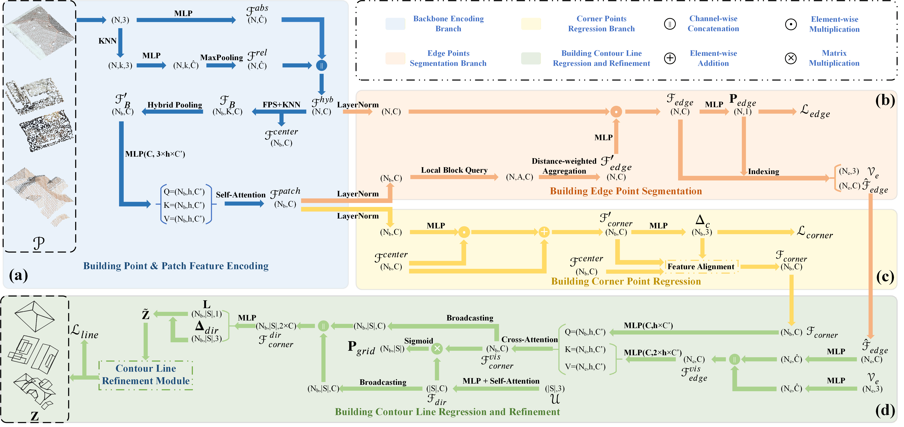

# Point2Contour

Building Rooftop Contouring from Airborne Laser Scanning Point Clouds.

## Table of Contents

- [Pipeline](#pipeline)
- [Requirements](#requirements)
- [Quick Start](#quick-start)
- [Dataset](#dataset)
- [Training and Predicting](#training-and-predicting)
- [Evaluation](#evaluation)
- [Post-processing and Applications](#post-processing-and-applications)

## Pipeline



## Requirements

(1) It is recommended to install this model in an isolated Conda environment with Python 3.9:

```bash
git clone https://github.com/Sen2Maker/Point2Contour.git
cd Point2Contour

conda create -n point2contour python=3.9 -y
conda activate point2contour
```

(2) This model was developed and tested with CUDA 12.6 and PyTorch 2.6.0. The corresponding PyTorch environment can be quickly installed as follows.

```bash
pip install torch==2.6.0 torchvision==0.21.0 torchaudio==2.6.0 \
  --index-url https://download.pytorch.org/whl/cu126
```
>**NOTE:** For other CUDA versions, install a compatible PyTorch version; compatibility with other CUDA versions is not guaranteed.

(3) Install simple dependencies:

```bash
pip install -r requirements.txt
```

(4) The KNN operations in this model depend on PyTorch3D. For the tested environment (Python 3.9, PyTorch 2.6.0, and CUDA 12.6), a third-party precompiled wheel can be installed as follows:

```bash
pip install --no-cache-dir \
  --find-links https://miropsota.github.io/torch_packages_builder/pytorch3d/ \
  "pytorch3d==0.7.9+pt2.6.0cu126"
```
> **NOTE:** This wheel is a third-party precompiled binary. For other environments, select an available wheel whose `pt` and `cu` suffixes match the installed PyTorch version and its CUDA build (e.g., use `pytorch3d==0.7.9+pt2.5.1cu121` for PyTorch 2.5.1 with CUDA 12.1). The Python version and operating system must also be supported. Simply changing these suffixes works only when the corresponding wheel has been published; otherwise, follow the [official instructions](https://github.com/facebookresearch/pytorch3d/blob/main/INSTALL.md#building--installing-from-source) to build PyTorch3D from source.

## Quick Start

(1) Download the pretrained models for Tallinn and Tokyo from [Google Drive](https://drive.google.com/drive/folders/1tpIILLWCVjMsOCTQFHZShXKJNx_BzOot) and place them in the `results` directory:

```text
results/
├── tallinn_full/
│   ├── config.yaml
│   └── checkpoints/
│       └── model_final.pth
└── tokyo_full/
    ├── config.yaml
    └── checkpoints/
        └── model_final.pth
```

(2) Predict by pretrained model:

```bash
# Activate the environment
conda activate point2contour

# Run inference on a single XYZ point cloud.
python pre_fromxyz.py \
  --xyz-root /path/to/point_cloud.xyz \
  --model-dir results/tallinn_full

# Optionally, run batch inference on all ID-named XYZ files in a directory.
python pre_fromxyz.py \
  --xyz-root /path/to/xyz \
  --model-dir results/tallinn_full
```

By default, the result is saved under `res_pre` using the point-cloud name and the current time:

```text
res_pre/
└── point_cloud_<YYYYMMDD_HHMMSS>/
    └── point_cloud/
        ├── pc.xyz
        ├── raw_topk.obj
        ├── pre_seg.obj
        └── pre_seg_nms.obj
```

The inference script prints the complete run directory, for example `res_pre/point_cloud_20260812_190000`.

## Dataset

### Dataset Download

We use the Tallinn and Tokyo roof datasets. Both can be requested from the [Building3D website](https://building3d.ucalgary.ca/reconstruction.php). Registration and acceptance of the dataset terms are required before downloading the files.

(1) **Tallinn** is the largest city subset of Building3D and is constructed from real aerial LiDAR data. Download **Tallinn City: Roof Point Clouds & Wireframe**, which provides an individual roof point cloud and its annotated wireframe for each building.

(2) **Tokyo LoD2** is a subset of BuildingWorld distributed through the same download page. It contains individual colored point clouds sampled from LoD2 building models, together with wireframes and mesh models. Download **Tokyo LoD2 Dataset**; Point2Contour only requires its roof point clouds and wireframes.

The synthetic Woerden transfer dataset is prepared separately from 3DBAG data using HELIOS++. Its complete acquisition and generation procedure is provided in [`tools/helios++/README.md`](tools/helios++/README.md).

For both datasets, the files used by Point2Contour are stored by building ID in the following Building3D format:

```text
dataset/
├── train/
│   ├── xyz/
│   │   ├── <id_1>.xyz
│   │   └── <id_2>.xyz
│   └── wireframe/
│       ├── <id_1>.obj
│       └── <id_2>.obj
└── test/
    └── xyz/
        ├── <id_3>.xyz
        └── <id_4>.xyz
```

To train Point2Contour on a custom dataset, organize it in the same Building3D format before preprocessing.

## Training and Predicting

### (1) Data Preprocessing

`data_pare.py` reads the Building3D-style dataset root and automatically processes all same-ID XYZ/OBJ pairs under `train/xyz` and `train/wireframe`. The `test` directory is not used during training-data preparation.

```bash
python data_pare.py \
  --data-root /path/to/dataset \
  --output-dir /path/to/processed_dataset
```

For each successfully processed building, the script jointly normalizes the point cloud and GT wireframe, constructs the point neighborhoods and local blocks used by the network, generates edge supervision and corner-ray data, and saves `pc_with_edge_c_full.pkl`. It then records every processed ID in `all.txt` and creates a deterministic 80%/20% training-validation split using random seed 42. No external ID lists are required.

```text
processed_dataset/
├── all.txt
├── train.txt                      # 80%
├── val.txt                        # 20%
├── building_0001/
│   └── pc_with_edge_c_full.pkl
├── building_0002/
│   └── pc_with_edge_c_full.pkl
└── logs/
```

The original center and scale are retained for restoring predictions to metric coordinates. All preprocessing settings match the released model configuration and are applied automatically. Point clouds without wireframe annotations can be predicted with `pre_fromxyz.py`, but cannot be used as supervised training samples.

### (2) Training

Start standard training with the processed dataset:

```bash
python train_net.py --data_root /path/to/processed_dataset
```

`--data_root` selects the processed dataset containing `train.txt` and `val.txt`. The standard training procedure and the released default configuration are used automatically.

Each run automatically creates a new numbered experiment directory:

```text
results/
└── Train_0001/
    ├── config.yaml
    ├── checkpoints/
    │   └── model_final.pth
    └── summaries/
```

Training requires an NVIDIA GPU with CUDA support. The generated `Train_XXXX` directory can be passed directly to the prediction scripts as `--model-dir`.

### (3) Predicting

For a dataset already converted by `data_pare.py`, use `pre.py` and select one of its split lists:

```bash
python pre.py \
  --data-root /path/to/processed_dataset \
  --model-dir results/Train_0001 \
  --split val
```

`--data-root` selects the processed dataset, `--split` selects the generated `train.txt` or `val.txt`, and `--model-dir` provides the saved configuration and weights. Use the raw-XYZ entry below for unannotated test point clouds.

For unprocessed point clouds, `pre_fromxyz.py` accepts either a single XYZ file or a flat directory of ID-named XYZ files:

```bash
# Predict a single XYZ file.
python pre_fromxyz.py \
  --xyz-root /path/to/point_cloud.xyz \
  --model-dir results/Train_0001

# Predict all XYZ files in a directory.
python pre_fromxyz.py \
  --xyz-root /path/to/xyz_directory \
  --model-dir results/Train_0001
```

The raw-XYZ entry performs the required preprocessing automatically. A same-ID wireframe directory may optionally be supplied with `--gt-root` when ground truth is available. Both prediction scripts load `model_final.pth` by default and automatically create `res_pre/<input_name>_<YYYYMMDD_HHMMSS>` under the project directory.

Each building is written to a separate result directory:

```text
res_pre/<input_name>_<timestamp>/
└── building_0001/
    ├── gt_wire.obj
    ├── pc.xyz
    ├── raw_topk.obj
    ├── pre_seg.obj
    └── pre_seg_nms.obj
```

`pc.xyz` contains the restored metric coordinates and predicted edge probability. `raw_topk.obj` stores the initial corner-query rays, while `pre_seg.obj` and `pre_seg_nms.obj` store the final refined line cloud before and after NMS. `gt_wire.obj` is meaningful when ground truth is available. All OBJ predictions are restored to the input coordinate system.

## Evaluation

Line-cloud evaluation reports the seven metrics used in the paper: edge geometry recall (`EGR`), edge geometry precision (`EGP`), edge geometry F1 (`GF1`), edge geometry distance (`EGD`), corner recall (`CR`), corner distance (`CD`), and line number (`LN`). Evaluation uses metric coordinates and a default distance threshold of `0.2 m`. Each scene is evaluated independently, and the reported dataset result is the mean of the scene-level metrics.

```bash
python eval/eval_lineseg.py --target-dir /path/to/inference_results
```

The input layout, metric definitions, output reports, and additional options are documented in [`eval/README.md`](eval/README.md).

## Post-processing and Applications

The primary output of Point2Contour is the predicted line cloud. For applications that require an explicit roof graph, `tools/post.py` can further convert it into a compact wireframe. The postprocessor clusters nearby endpoints, aggregates repeated segment evidence, and applies geometric and point-support constraints to construct candidate edges.

```bash
python tools/post.py --data-root res_pre/point_cloud_20260812_190000
```

The script reads `pre_seg.obj` and `pc.xyz` from each scene and writes `pre_wire.obj` in the same directory. `tools/query_post.py` is also provided for producing a more concise line cloud.

### Wireframe Evaluation

The generated wireframe can be evaluated with the Building3D-style corner and edge metrics implemented in `eval_ap.py`:

```bash
python eval/eval_ap.py \
  --target-dir res_pre/point_cloud_20260812_190000 \
  --prediction wireframe=pre_wire.obj
```

The script reads `gt_wire.obj` from each scene and uses a default matching threshold of `0.2 m`.
